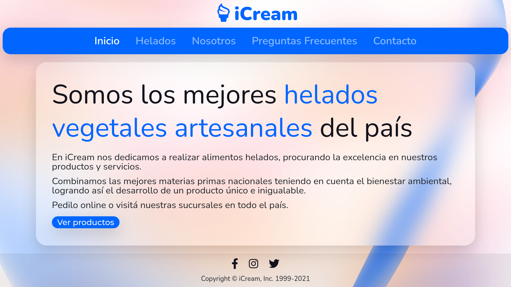

# icream-web
Sitio Web de iCream, desarrollado para el curso de Desarrollo Web de CoderHouse.

Para ver un ejemplo en vivo, **[haz click aquí](https://ayrton30.github.io/icream-web/)**.

## Caracteristicas
- Diseño responsive.
- Animaciones y transformaciones.

## Secciones
✔️ Inicio
✔️ Helados
✔️ Nosotros
✔️ Preguntas Frecuentes
✔️ Contacto

## Tecnologias utilizadas
- [Bootstrap](https://getbootstrap.com/)
- [Sass](https://sass-lang.com/)
