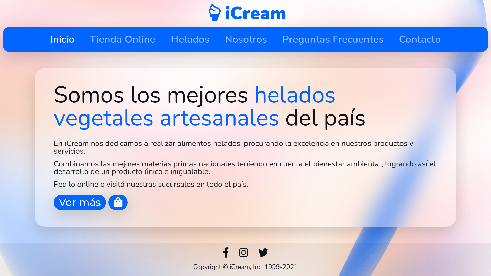
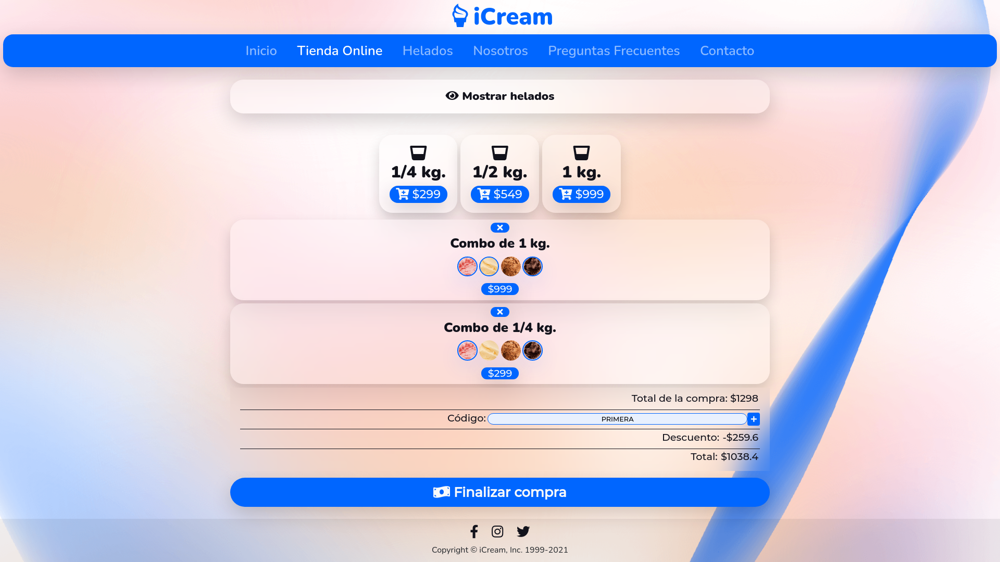

# icream-web
Sitio Web de iCream, desarrollado para el curso de Desarrollo Web de CoderHouse.

El cliente puede elegir entre 3 combos distintos, de 250, 500 y 1000 g. Para el primero solo puede elegir 2 sabores de helado, para el segundo 3 y para el combo de 1kg el usuario puede seleccionar hasta 4 sabores diferentes.

Para ver un ejemplo en vivo, **[haz click aquí](https://ayrton30.github.io/icream-web/)**.

## Caracteristicas
- Diseño responsive.
- Animaciones y transformaciones.

## Secciones
✔️ Inicio
✔️ Helados
✔️ Nosotros
✔️ Preguntas Frecuentes
✔️ Contacto

## Tecnologias utilizadas
- [Bootstrap](https://getbootstrap.com/)
- [Sass](https://sass-lang.com/)
